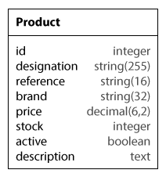

# ekyna-learn/sf-product

## Création d'une administration de produits.

L'intégration HTML des pages est disponible dans le dossier _integration/Product_.

1. Cloner ce dépôt :

        git clone https://github.com/ekyna-learn/sf-product.git
    
2. Initialiser le projet :

        cd sf-product
        composer install

3. Créer et configurer la base de données.

4. Créer l'entité Product d'après le schema suivant.

    

5. Développer les routes, contrôleurs et templates pour réaliser les URLs suivantes :

    URL | Contenu
    ----- | ----
    /product | [Liste des produits](integration/Product/index.html)
    /product/create | [Formulaire ajout](integration/Product/new.html)
    /product/&lt;id&gt; | [Fiche détail produit](integration/Product/show.html)
    /product/&lt;id&gt;/update | [Formulaire modification](integration/Product/edit.html)
    /product/&lt;id&gt;/delete | [Formulaire suppression](integration/Product/delete.html)
